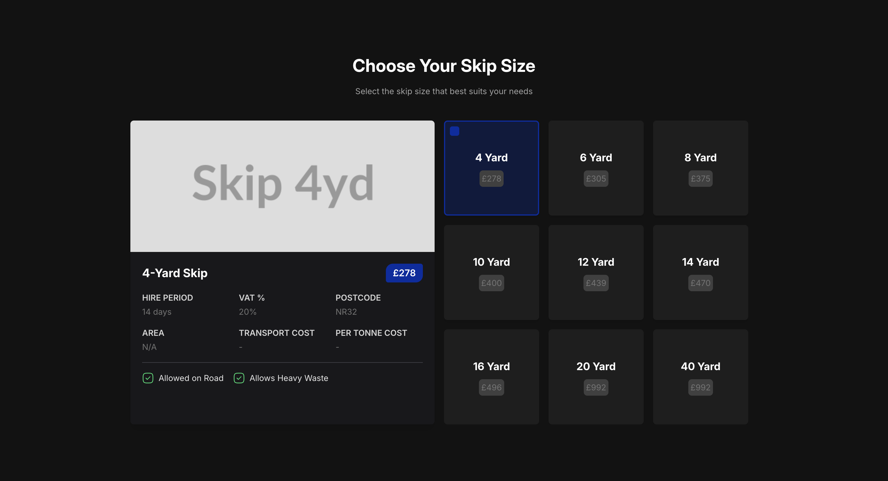
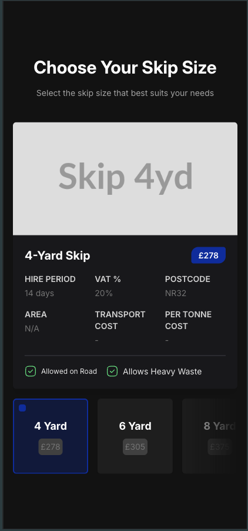

# Waste Redesign App

A responsive React/TypeScript app for browsing and selecting skip-hire sizes, with client-side pagination, edge-fade masks, and a detailed view card. Includes dynamic image placeholders for skip previews.

---

## Screenshots

  


---

## 📝 Table of Contents

- [Features](#features)
- [Tech Stack](#tech-stack)
- [Getting Started](#getting-started)
  - [Prerequisites](#prerequisites)
  - [Installation](#installation)
  - [Environment Variables](#environment-variables)
  - [Running Locally](#running-locally)
- [Project Structure](#project-structure)
- [Design & Architecture](#design--architecture)
  - [Responsive Layout](#responsive-layout)
  - [Client-Side Pagination](#client-side-pagination)
  - [Edge-Fade Mask Hook](#edge-fade-mask-hook)
  - [Reusable Components](#reusable-components)
  - [Accessibility](#accessibility)
- [Customization](#customization)

---

## 🌟 Features

- **Desktop Grid**: two-column layout with a detail panel and a 3-column card grid
- **Tablet/Mobile Scroll**: single-row scroll with snap-to-card and edge-fade masks
- **Client-Side Pagination**: navigate large sets of skip cards without refetching
- **Detail View**: full breakdown of a selected skip (size, price, costs, VAT, location, statuses)
- **Image Placeholders**: dynamic placeholder images via [placehold.co] for quick visual previews
- **Keyboard & Screen-Reader Friendly**: `role="button"`, `tabIndex`, `aria-pressed`, and key handlers

---

## 🛠 Tech Stack

- **Framework**: React 18 + TypeScript
- **Data Fetching**: React Query (`@tanstack/react-query`) / Axios
- **Styling**: Tailwind CSS + `clsx`
- **Media Queries**: `use-media` hook
- **Icons**: Iconsax React
- **Bundler**: Vite

---

## 🏁 Getting Started

### Prerequisites

- Node.js v20 or higher
- yarn

_Backend endpoint required:_

```

GET /api/skips/by-location?postcode=NR32\&area=Lowestoft

```

### Installation

```bash
git clone https://github.com/EDAMGHY/waste-redesign-app
cd waste-redesign-app
yarn install
```

### Environment Variables

Create a `.env` file (or copy `.env.example`):

```env
VITE_BACKEND_URL=https://app.wewantwaste.co.uk
```

### Running Locally

```bash
yarn dev
```

Visit `http://localhost:3000`.

---

## 📂 Project Structure

```
src/
├── api/
│   └── api.ts                # Axios instance & base URL
├── components/
│   ├── ItemCard.tsx          # Label/value UI card
│   ├── PaginationControls.tsx
│   ├── SkipCard.tsx
│   └── SelectedSkipCard.tsx
├── hooks/
│   └── useEdgeMask.ts        # Scroll-mask hook
├── App.tsx                   # Main application entry
└── types/
    └── ISkip.ts              # Skip data interface
```

---

## 🎨 Design & Architecture

### Responsive Layout

- **Desktop**

  - Left: detail panel (`SelectedSkipCard`)
  - Right: 3-column grid of `SkipCard` components
  - Pagination controls above the grid when needed

- **Tablet/Mobile**

  - Full-width horizontal scroll of `SkipCard`s
  - Scroll snapping and edge-fade masks hint at more cards

Tailwind utilities (`lg:grid-cols-3`, `overflow-x-auto`, `snap-x snap-mandatory`, etc.) drive breakpoints and layout changes.

### Client-Side Pagination

- Controlled by a `PAGE_SIZE` constant

- Uses `useMemo` to derive the slice for the current page:

  ```ts
  const paginated = useMemo(() => {
    const start = (page - 1) * PAGE_SIZE;
    return skips.slice(start, start + PAGE_SIZE);
  }, [skips, page]);
  ```

- `<PaginationControls>` supplies prev/next buttons and page indicator.

### Edge-Fade Mask Hook

- `useEdgeMask(ref, options)` returns `{ showLeftMask, showRightMask }`
- Monitors `scroll` and `resize` to toggle masks when content overflows
- Tailwind mask classes fade the container’s edges:

  ```css
  .mask-alpha {
    mask-image: linear-gradient(to right, black, transparent);
    /* and the inverse for right edge */
  }
  ```

### Reusable Components

- **`SkipCard`**: clickable card showing skip size, hire period, and price
- **`SelectedSkipCard`**: detailed view with placeholder image, stats grid, and status badges
- **`ItemCard`**: generic label/value display used inside the detail view
- **`PaginationControls`**: page navigation UI

### Accessibility

- Cards use `role="button"`, `tabIndex={0}`, and `onKeyDown` for Enter/Space
- `aria-pressed` indicates the selected state
- Semantic headings, labels, and logical tab order throughout

---

## ⚙️ Customization

- **Page size**: update the `PAGE_SIZE` constant in `App.tsx`
- **Mask threshold**: pass `{ threshold: X }` to `useEdgeMask`
- **Styling**: tweak Tailwind classes or extend the design system
- **Data fields**: extend `ISkip` and update the detail grid

---

```text
© 2025 DAMRI ABDELLA / EDAMGHY – MIT License
```
